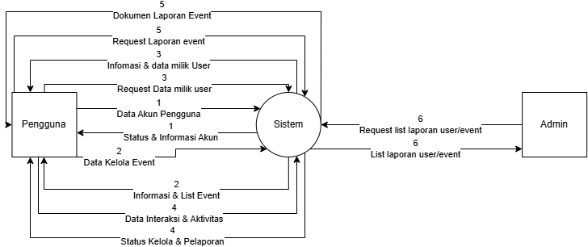
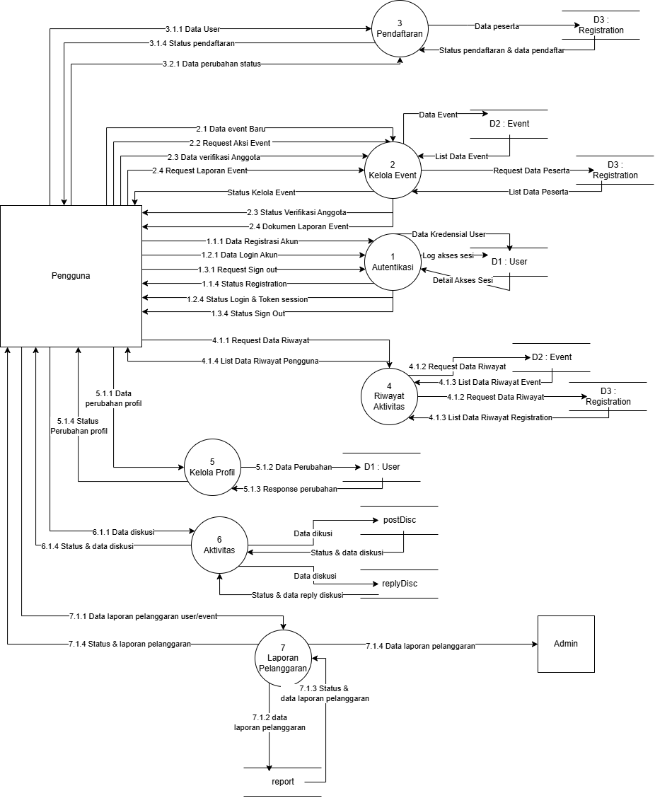

# 🚀 Tugas Besar: VOLYNC

> **Dosen Pengampu:** Muhammad Shiddiq Azis, S.T., MBA

---

## 📊 Perancangan Sistem (DFD)

### DFD Level 0

_Diagram Konteks yang menunjukkan aliran data global._

### DFD Level 1

_Detail proses bisnis dan integrasi database._

---

## 🎨 Mockup Antarmuka

Rancangan UI aplikasi yang berfokus pada pengalaman pengguna.

|                                                 Login Page                                                  |                                                   Home Page                                                    |                                                         Core Feature                                                         |
| :---------------------------------------------------------------------------------------------------------: | :------------------------------------------------------------------------------------------------------------: | :--------------------------------------------------------------------------------------------------------------------------: |
|  |  |  |

---

## 🛠️ Stack Teknologi

- **Frontend:** Dart / Flutter
- **Backend:** Dart
- **Database:** PostgreSQL

---

## 📂 Cara Instalasi

1. `git clone [url-repo]`
2. `npm install` (atau sesuaikan dengan environment)
3. `npm run dev`
